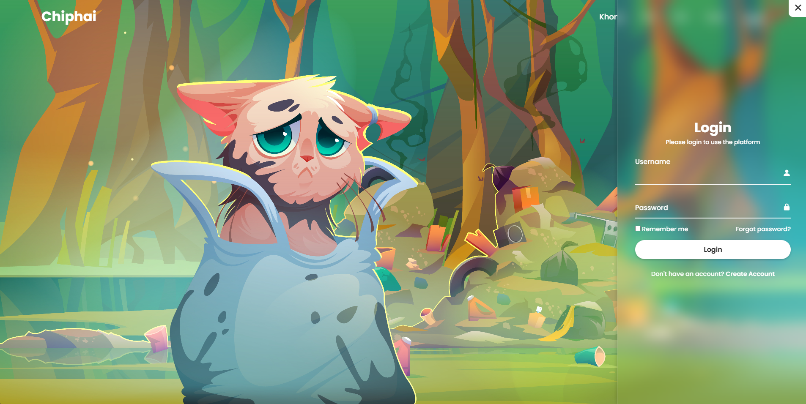
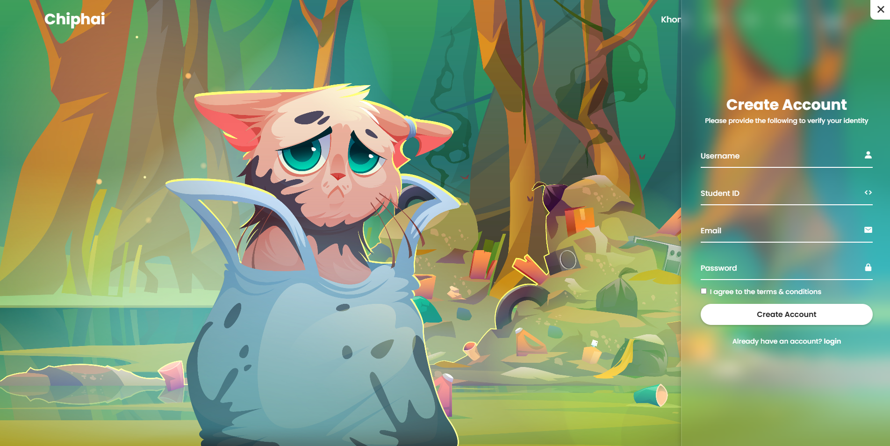
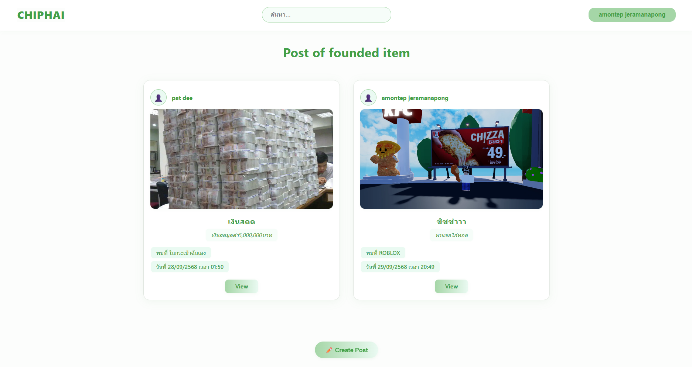
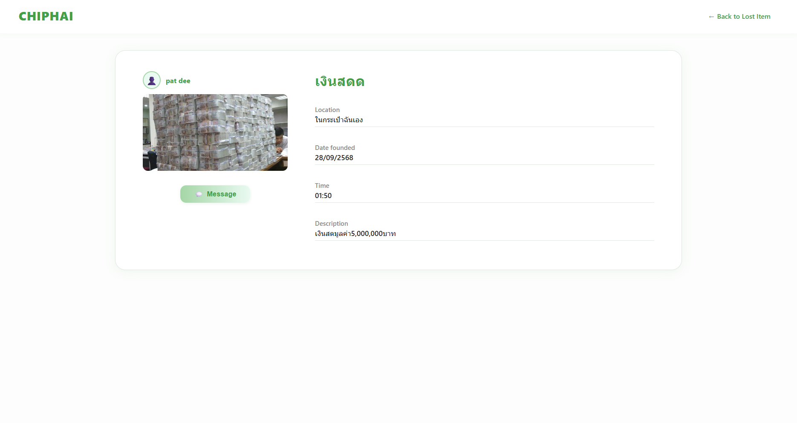
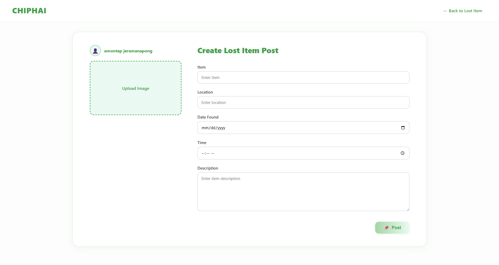

# 🎒 Lost & Found System (Web Application)

โปรเจกต์นี้เป็น **ระบบเว็บหาของหายในมหาวิทยาลัย**  
ช่วยให้นักศึกษาและบุคลากรสามารถ  
- ลงทะเบียน / เข้าสู่ระบบ  
- โพสต์สิ่งของที่หายหรือพบเจอ  
- ดูรายการโพสต์ และรายละเอียดสิ่งของ  

> พัฒนาโดยใช้ **HTML + CSS + JavaScript + Firebase**

---

## 🚀 Features
- ✅ ลงทะเบียน (Register) และ เข้าสู่ระบบ (Login) ด้วย Firebase Authentication  
- ✅ สร้างโพสต์สิ่งของที่หายหรือพบเจอ พร้อมรายละเอียด  
- ✅ ดูรายการโพสต์ทั้งหมด  
- ✅ เปิดดูรายละเอียดโพสต์เฉพาะ  
- ✅ เก็บข้อมูลผู้ใช้และโพสต์บน Firebase  

---

## 🛠️ Tech Stack
  
  
  
  

---

## 📸 Screenshots

### 🔑 Login Page

### 📝 Register Page

### 📋 Post List Page

### 📖 Post Detail Page

### ➕ Create Post Page

---

## 📌 Future Improvements
- 🔒 เพิ่มระบบเข้ารหัสรหัสผ่าน และการจัดการความปลอดภัย
- ⚡ ระบบค้นหาและกรองโพสต์ (เช่น ค้นหาตามหมวดหมู่, วันที่, สถานที่)
- 🤝 ระบบแจ้งเตือน (Notification) สำหรับโพสต์หรือข้อความใหม่
- ✨ ปรับปรุง UI/UX ให้ใช้งานง่ายขึ้น และรองรับการใช้งานบนมือถือ (Responsive Design)  
 
---

## 🙏 Acknowledgements
ขอขอบคุณอาจารย์ ผู้ให้คำแนะนำ ครอบครัว และเพื่อนๆ ที่สนับสนุนการทำโปรเจกต์นี้ 💙
